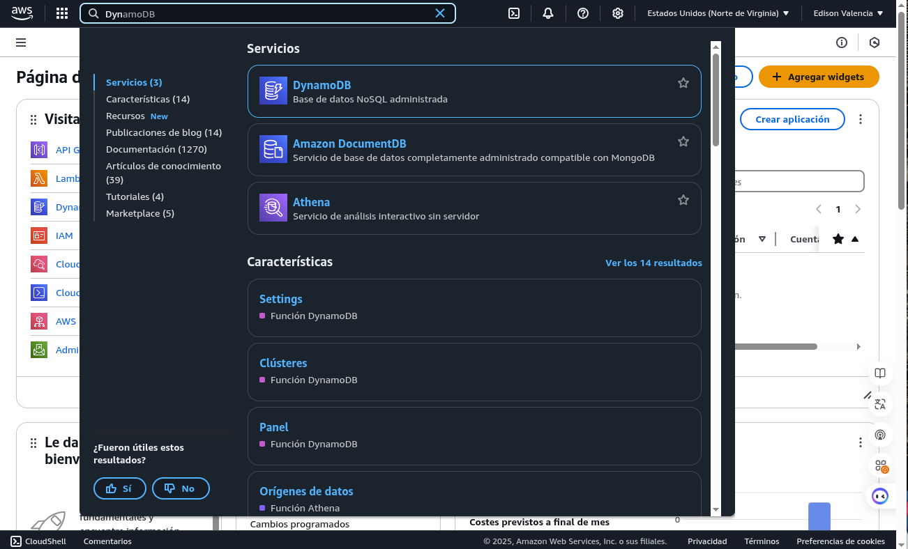
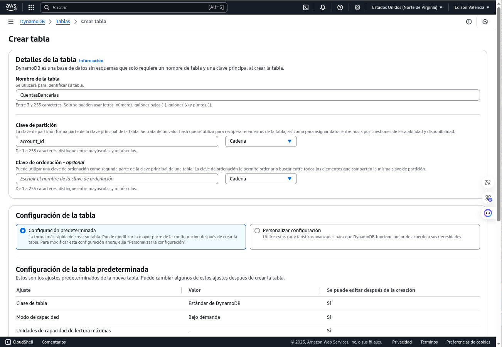

# Guía Completa: Crear un Servicio en AWS con Lambda y DynamoDB para Consultar Saldos Bancarios
Este documento se basa en tecnologías disponibles al 03 de abril de 2025.


## Descripción del Ejemplo a Desarrollar

En esta guía, construiremos un servicio serverless en AWS que permita a un cliente bancario consultar el saldo de su cuenta usando un identificador único (`account_id`). Este ejemplo simula un caso práctico de banca digital, donde los usuarios pueden acceder a sus datos financieros desde aplicaciones móviles o web de manera eficiente y segura. Utilizaremos:

- **AWS Lambda**: Para procesar solicitudes de consulta sin gestionar servidores, ideal para operaciones rápidas y escalables.
- **Amazon DynamoDB**: Como base de datos NoSQL para almacenar información de cuentas (ID, nombre del cliente y saldo), ofreciendo alta disponibilidad y rendimiento.
- **Amazon API Gateway**: Para exponer el servicio como una API REST pública, permitiendo integraciones externas.
- **Postman**: Para probar la API de forma manual y verificar su correcto funcionamiento.
- **HTML/JavaScript**: Para crear una página web estática que llame al API directamente desde el navegador, sin necesidad de un servidor web.

El resultado será un sistema funcional que cualquier institución bancaria podría usar como base para servicios digitales, con énfasis en simplicidad, escalabilidad y bajo costo operativo.

---

## Requisitos Previos

- Una cuenta de AWS (puedes usar el nivel gratuito para este ejemplo).
- Conocimientos básicos de AWS, Python, y HTML/JavaScript (aunque explicaremos cada paso).
- Postman instalado o acceso a [https://app.getpostman.com](https://app.getpostman.com).
- Un navegador web moderno (Chrome, Firefox, etc.).

---

## Paso a Paso Detallado

### Paso 1: Configurar tu Entorno en AWS

#### Descripción de la Tecnología y Propósito
AWS (Amazon Web Services) es una plataforma líder de computación en la nube que ofrece servicios gestionados como almacenamiento, cómputo y bases de datos. En este paso, configuramos el entorno inicial para acceder a Lambda, DynamoDB y otros servicios necesarios. Elegir una región específica asegura que los datos se almacenen en una ubicación geográfica controlada, algo esencial en banca por cumplimiento normativo (ej. GDPR, regulaciones locales).

#### Instrucciones
1. **Inicia sesión en AWS**:
   - Ve a [aws.amazon.com](https://aws.amazon.com) y accede con tu cuenta. Si no tienes una, crea una cuenta (el nivel gratuito incluye 12 meses de acceso limitado a muchos servicios).
2. **Selecciona una región**:
   - En la esquina superior derecha de la consola, elige una región cercana o relevante (ej. `us-east-1` en Virginia, EE.UU.). Esto afecta la latencia y el cumplimiento legal.
3. **Verifica permisos**:
   - Ve a "IAM" en la consola AWS.
   - Asegúrate de que tu usuario o rol tenga permisos para:
     - `AWSLambda_FullAccess`
     - `AmazonDynamoDBFullAccess`
     - `AmazonAPIGatewayAdministrator`
     - `CloudWatchLogsFullAccess`
   - Si no tienes permisos, solicita a un administrador o crea un rol con estas políticas.

---

### Paso 2: Crear una Tabla en DynamoDB

#### Descripción de la Tecnología y Propósito
Amazon DynamoDB es una base de datos NoSQL gestionada que almacena datos en formato clave-valor o documentos. Es ideal para aplicaciones bancarias por su escalabilidad horizontal, baja latencia y capacidad para manejar millones de transacciones. Aquí, creamos una tabla para almacenar cuentas bancarias, usando `account_id` como clave primaria para consultas rápidas y únicas.

#### Instrucciones
1. **Accede a DynamoDB**:
   - En la consola AWS, busca "DynamoDB" en la barra de servicios y haz clic en él.
   - 
2. **Crea una tabla**:
   - Haz clic en "Crear tabla".
   - **Nombre de la tabla**: `CuentasBancarias`.
   - **Clave de partición**: `account_id` (tipo: String). Esto será el identificador único de cada cuenta.
   - **Configuración de capacidad**: Selecciona "On-Demand" (pago por uso, sin preocuparte por provisionar capacidad). Para producción, podrías ajustar esto a "Provisioned" con límites específicos.
   - Haz clic en "Crear".
   - 
3. **Agrega datos de ejemplo**:
   - Ve a la pestaña "Elementos" dentro de la tabla `CuentasBancarias`.
   - Haz clic en "Crear elemento" y agrega manualmente:
     ```json
     {
       "account_id": "12345",
       "customer_name": "Juan Pérez",
       "balance": 1500.75
     }
     ```
