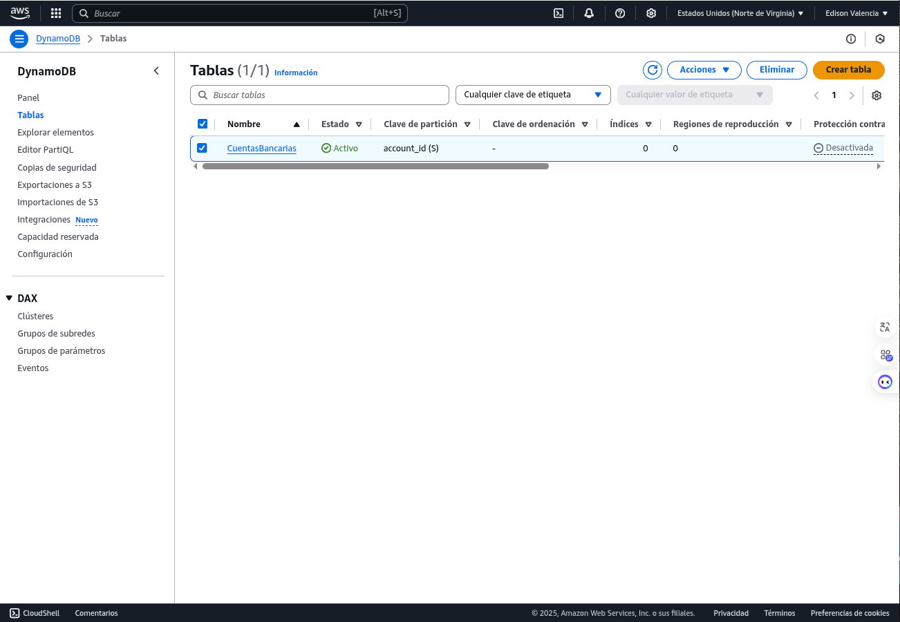
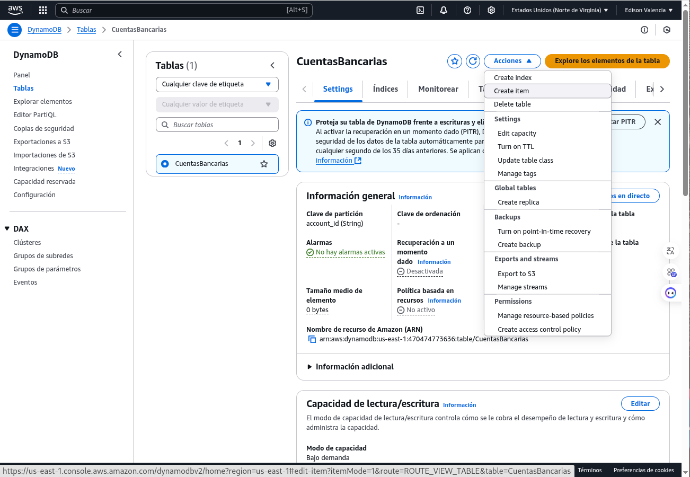
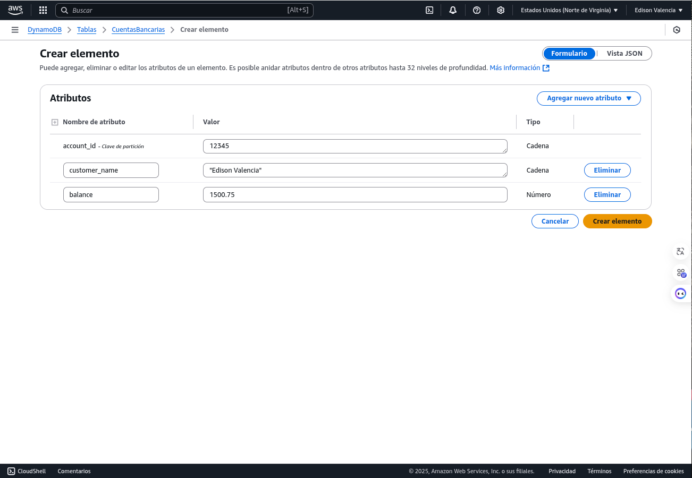
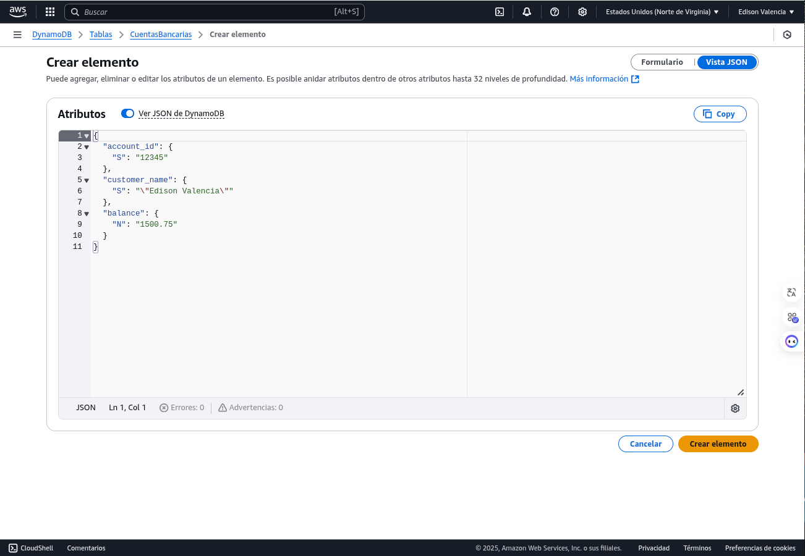
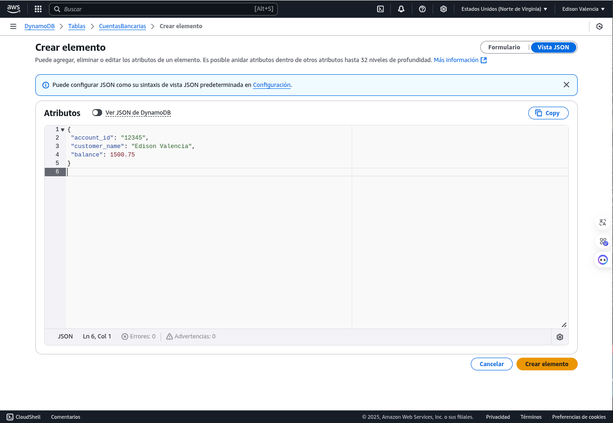
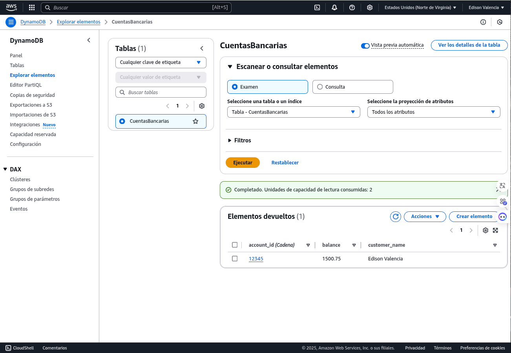
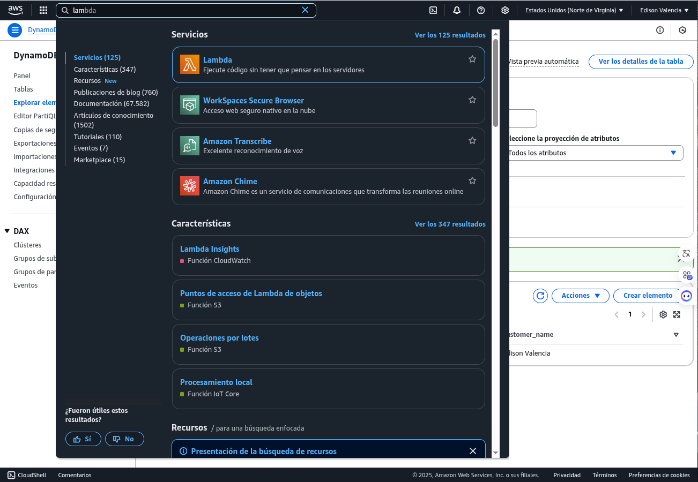
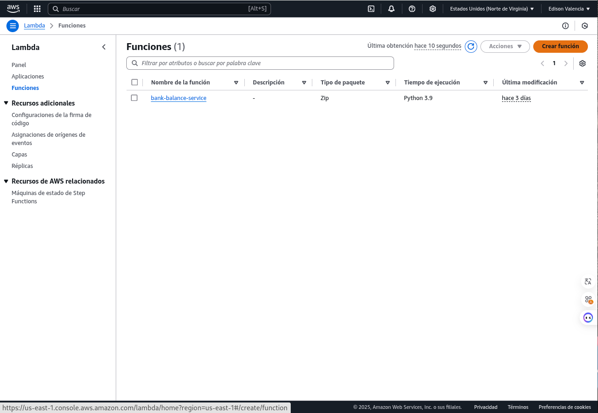
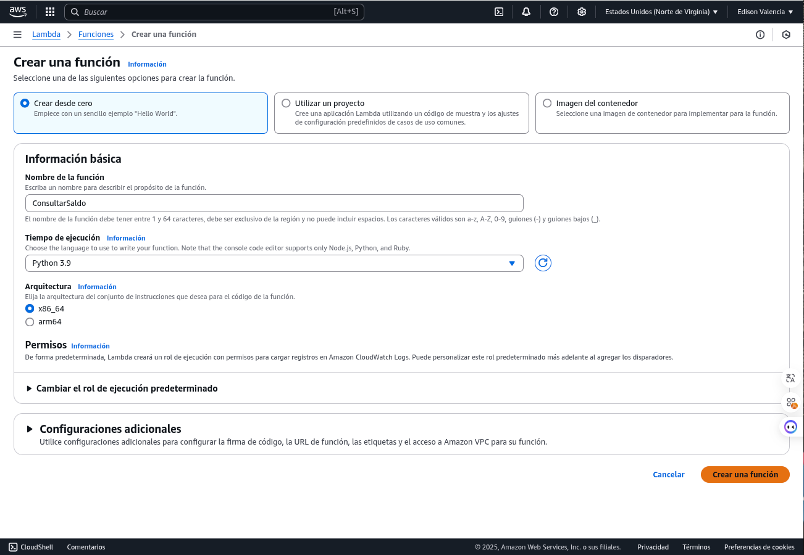

# Guía Completa: Crear un Servicio en AWS con Lambda y DynamoDB para Consultar Saldos Bancarios
Este documento se basa en tecnologías disponibles al 03 de abril de 2025.


## Descripción del Ejemplo a Desarrollar

En esta guía, construiremos un servicio serverless en AWS que permita a un cliente bancario consultar el saldo de su cuenta usando un identificador único (`account_id`). Este ejemplo simula un caso práctico de banca digital, donde los usuarios pueden acceder a sus datos financieros desde aplicaciones móviles o web de manera eficiente y segura. Utilizaremos:

- **AWS Lambda**: Para procesar solicitudes de consulta sin gestionar servidores, ideal para operaciones rápidas y escalables.
- **Amazon DynamoDB**: Como base de datos NoSQL para almacenar información de cuentas (ID, nombre del cliente y saldo), ofreciendo alta disponibilidad y rendimiento.
- **Amazon API Gateway**: Para exponer el servicio como una API REST pública, permitiendo integraciones externas.
- **Postman**: Para probar la API de forma manual y verificar su correcto funcionamiento.
- **HTML/JavaScript**: Para crear una página web estática que llame al API directamente desde el navegador, sin necesidad de un servidor web.

El resultado será un sistema funcional que cualquier institución bancaria podría usar como base para servicios digitales, con énfasis en simplicidad, escalabilidad y bajo costo operativo.

---

## Requisitos Previos

- Una cuenta de AWS (puedes usar el nivel gratuito para este ejemplo).
- Conocimientos básicos de AWS, Python, y HTML/JavaScript (aunque explicaremos cada paso).
- Postman instalado o acceso a [https://app.getpostman.com](https://app.getpostman.com).
- Un navegador web moderno (Chrome, Firefox, etc.).

---

## Paso a Paso Detallado

### Paso 1: Configurar tu Entorno en AWS

#### Descripción de la Tecnología y Propósito
AWS (Amazon Web Services) es una plataforma líder de computación en la nube que ofrece servicios gestionados como almacenamiento, cómputo y bases de datos. En este paso, configuramos el entorno inicial para acceder a Lambda, DynamoDB y otros servicios necesarios. Elegir una región específica asegura que los datos se almacenen en una ubicación geográfica controlada, algo esencial en banca por cumplimiento normativo (ej. GDPR, regulaciones locales).

#### Instrucciones
1. **Inicia sesión en AWS**:
   - Ve a [aws.amazon.com](https://aws.amazon.com) y accede con tu cuenta. Si no tienes una, crea una cuenta (el nivel gratuito incluye 12 meses de acceso limitado a muchos servicios).
2. **Selecciona una región**:
   - En la esquina superior derecha de la consola, elige una región cercana o relevante (ej. `us-east-1` en Virginia, EE.UU.). Esto afecta la latencia y el cumplimiento legal.
3. **Verifica permisos**:
   - Ve a "IAM" en la consola AWS.
   - Asegúrate de que tu usuario o rol tenga permisos para:
     - `AWSLambda_FullAccess`
     - `AmazonDynamoDBFullAccess`
     - `AmazonAPIGatewayAdministrator`
     - `CloudWatchLogsFullAccess`
   - Si no tienes permisos, solicita a un administrador o crea un rol con estas políticas.

---

### Paso 2: Crear una Tabla en DynamoDB

#### Descripción de la Tecnología y Propósito
Amazon DynamoDB es una base de datos NoSQL gestionada que almacena datos en formato clave-valor o documentos. Es ideal para aplicaciones bancarias por su escalabilidad horizontal, baja latencia y capacidad para manejar millones de transacciones. Aquí, creamos una tabla para almacenar cuentas bancarias, usando `account_id` como clave primaria para consultas rápidas y únicas.

#### Instrucciones
1. **Accede a DynamoDB**:
   - En la consola AWS, busca "DynamoDB" en la barra de servicios y haz clic en él.
   - 
2. **Crea una tabla**:
   - Haz clic en "Crear tabla".
   - **Nombre de la tabla**: `CuentasBancarias`.
   - **Clave de partición**: `account_id` (tipo: String). Esto será el identificador único de cada cuenta.
   - **Configuración de capacidad**: Selecciona "On-Demand" (pago por uso, sin preocuparte por provisionar capacidad). Para producción, podrías ajustar esto a "Provisioned" con límites específicos.
   - Haz clic en "Crear".
   - 
3. **Agrega datos de ejemplo**:
   - Ve a la pestaña "Elementos" dentro de la tabla `CuentasBancarias`.
      
   - Haz clic en "Crear elemento" y agrega manualmente:
          
      - FORMATO JSON DynamoBD
     ```json
     {
        "account_id": {
          "S": "12345"
        },
        "customer_name": {
          "S": "Edison Valencia"
        },
        "balance": {
          "N": "1500.75"
        }
      }
     ```
     
     - FORMATO JSON
     ```json
     {
       "account_id": "12345",
       "customer_name": "Edison Valencia",
       "balance": 1500.75
      }
     ```
     

- Así se crea un registro en la base de datos.
      

## Paso 3: Crear una Función Lambda

### Descripción de la Tecnología y Propósito

AWS Lambda es un servicio de cómputo serverless que ejecuta código en respuesta a eventos (como solicitudes HTTP). No requiere gestión de servidores, lo que reduce costos y complejidad, ideal para operaciones bancarias frecuentes como consultas de saldo. En este caso, Lambda recuperará datos de DynamoDB según el `account_id` recibido.

### Instrucciones

1.  **Accede a Lambda:** En la consola AWS, busca "Lambda" y selecciona "Crear función".
     
3.  **Configura la función:**
    * Elige "Crear desde cero".
    * **Nombre:** `ConsultarSaldo`.
    * **Runtime:** Python 3.9 (puedes usar Node.js u otro si prefieres, ajustando el código).
    * **Rol de ejecución:** Usa el rol predeterminado por ahora (lo ajustaremos en el siguiente paso).
    * Haz clic en "Crear función".
      
4.  **Escribe el código:** En el editor de Lambda, reemplaza el contenido con:

    ```python
    import json
    import boto3
    from decimal import Decimal

    # Inicializa el cliente de DynamoDB
    dynamodb = boto3.resource('dynamodb')
    table = dynamodb.Table('CuentasBancarias')

    def lambda_handler(event, context):
        # Extrae el account_id del evento (soporta query parameters o body)
        account_id = event.get('queryStringParameters', {}).get('account_id') if 'queryStringParameters' in event else event.get('account_id')

        # Valida que se proporcione un account_id
        if not account_id:
            return {
                'statusCode': 400,
                'body': json.dumps({'error': 'Se requiere account_id'})
            }

        # Consulta DynamoDB
        try:
            response = table.get_item(Key={'account_id': account_id})
            if 'Item' in response:
                item = response['Item']
                return {
                    'statusCode': 200,
                    'body': json.dumps({
                        'account_id': item['account_id'],
                        'customer_name': item['customer_name'],
                        'balance': float(item['balance'])  # Convierte Decimal a float para JSON
                    })
                }
            else:
                return {
                    'statusCode': 404,
                    'body': json.dumps({'error': 'Cuenta no encontrada'})
                }
        except Exception as e:
            return {
                'statusCode': 500,
                'body': json.dumps({'error': str(e)})
            }
    ```
   
    Este código:
    * Conecta a DynamoDB.
    * Busca un registro por `account_id`.
    * Devuelve el saldo o un error en formato JSON.

5.  **Guarda el código:** Haz clic en "Deploy" para aplicar los cambios.

# Paso 4: Configurar Permisos

## Descripción de la Tecnología y Propósito

IAM (Identity and Access Management) gestiona permisos en AWS, asegurando que solo los servicios autorizados accedan a los recursos. Aquí, damos a Lambda permisos para leer de DynamoDB, manteniendo la seguridad de los datos bancarios, un requisito crítico en este sector.

## Instrucciones

1.  **Ve a permisos en Lambda:** En la página de la función `ConsultarSaldo`, ve a la pestaña "Configuración" > "Permisos".
2.  **Edita el rol de ejecución:** Haz clic en el enlace del "Rol de ejecución" (se abrirá IAM). El rol tendrá un nombre como `AWSLambdaBasicExecutionRole-<id>`.
3.  **Adjunta una política:**
    * Haz clic en "Adjuntar políticas".
    * Busca y selecciona `AmazonDynamoDBReadOnlyAccess`.
    * Haz clic en "Adjuntar política".
4.  **Guarda los cambios:** Esto permite a Lambda leer de la tabla `CuentasBancarias`.

# Paso 5: Probar la Función Lambda

## Descripción de la Tecnología y Propósito

La herramienta de pruebas de Lambda simula eventos para verificar el código antes de integrarlo con otros sistemas. Esto asegura que la lógica de consulta funcione, un paso esencial para garantizar confiabilidad en un entorno bancario.

## Instrucciones

1.  **Crea un evento de prueba:** En la interfaz de Lambda, haz clic en "Probar".
2.  **Selecciona "Crear nuevo evento".**
3.  **Usa este JSON:**

    ```json
    {
      "queryStringParameters": {
        "account_id": "12345"
      }
    }
    ```

    Nómbralo `TestConsulta` y haz clic en "Crear".
4.  **Ejecuta la prueba:** Haz clic en "Probar".
5.  **Verifica la respuesta:**

    ```json
    {
      "statusCode": 200,
      "body": "{\"account_id\": \"12345\", \"customer_name\": \"Juan Pérez\", \"balance\": 1500.75}"
    }
    ```

    Prueba también con `account_id` igual a `67890` (debería ser exitoso) y `99999` (debería dar un error 404).

# Paso 6: Integrar con API Gateway

## Descripción de la Tecnología y Propósito

Amazon API Gateway crea APIs RESTful que conectan servicios como Lambda con clientes externos (apps, webs). Aquí, exponemos `ConsultarSaldo` como un endpoint público, simulando un acceso bancario real desde dispositivos de usuarios.

## Instrucciones

1.  **Crea un API:** En la consola, busca "API Gateway" y selecciona "Crear API".
2.  **Elige "REST API" > "Construir".**
3.  **Nombre:** `BancoAPI`.
4.  **Configura un recurso:**
    * Haz clic en "Acciones" > "Crear recurso".
    * **Nombre del recurso:** `saldo`.
    * **Ruta:** `/saldo`.
5.  **Agrega un método:**
    * Selecciona el recurso `/saldo` y haz clic en "Acciones" > "Crear método".
    * Elige `GET`.
    * **Tipo de integración:** "Lambda Function".
    * **Región:** La misma que usaste (ej. `us-east-1`).
    * **Función:** `ConsultarSaldo`.
    * Haz clic en "Guardar".
6.  **Configura parámetros:** Ve a "Solicitud de integración". Asegúrate de que los parámetros de consulta (`account_id`) se pasen a Lambda.
7.  **Despliega el API:**
    * Haz clic en "Acciones" > "Desplegar API".
    * **Etapa:** `prod` (o el nombre que prefieras).
    * Copia la URL generada (ej. `https://<id>.execute-api.<region>.amazonaws.com/prod/saldo`).

# Paso 6.1: Probar la API con Postman

## Descripción de la Tecnología y Propósito

Postman (https://app.getpostman.com) es una herramienta para probar APIs enviando solicitudes HTTP y analizando respuestas. Aquí, verificamos que el endpoint de API Gateway funcione, simulando cómo un desarrollador bancario probaría el servicio.

## Instrucciones

1.  **Instala Postman:** Descarga desde https://www.postman.com/downloads/ o usa la versión web en https://app.getpostman.com.
2.  **Crea una solicitud:** Abre Postman y selecciona "New" > "HTTP Request".
3.  **Método:** `GET`.
4.  **URL:** `https://<tu-url>/saldo?account_id=12345` (reemplaza `<tu-url>` con tu URL de API Gateway).
5.  **Envía la solicitud:** Haz clic en "Send".
6.  **Verifica la respuesta:**

    ```json
    {
      "account_id": "12345",
      "customer_name": "Juan Pérez",
      "balance": 1500.75
    }
    ```

    **Pruebas adicionales:** Cambia `account_id` a `67890` (debería ser exitoso) y `99999` (debería dar un error 404) para validar todos los casos.

# Paso 6.2: Crear una Página Web que Llame al API sin Servidor Web

## Descripción de la Tecnología y Propósito

Usaremos HTML y JavaScript puro para crear una página estática que se ejecute en el navegador, aprovechando `fetch` para llamar al API. Esto elimina la necesidad de un servidor web, ideal para demos o aplicaciones ligeras en banca.

## Instrucciones

1.  **Crea un archivo `index.html`:** Abre un editor de texto (Notepad, VS Code, etc.) y pega:

    ```html
    <!DOCTYPE html>
    <html lang="es">
    <head>
        <meta charset="UTF-8">
        <title>Consulta de Saldo Bancario</title>
        <style>
            body { font-family: Arial, sans-serif; margin: 20px; }
            #result { margin-top: 20px; }
        </style>
    </head>
    <body>
        <h1>Consulta tu saldo</h1>
        <label for="accountId">ID de la cuenta:</label>
        <input type="text" id="accountId" placeholder="Ej: 12345">
        <button onclick="consultarSaldo()">Consultar</button>
        <div id="result"></div>
        <script>
            async function consultarSaldo() {
                const accountId = document.getElementById('accountId').value;
                const apiUrl = `https://<tu-url>/saldo?account_id=${accountId}`; // Reemplaza <tu-url>
                const resultDiv = document.getElementById('result');
                try {
                    const response = await fetch(apiUrl);
                    const data = await response.json();
                    if (response.ok) {
                        resultDiv.innerHTML = `
                            <p><strong>Cuenta:</strong> ${data.account_id}</p>
                            <p><strong>Cliente:</strong> ${data.customer_name}</p>
                            <p><strong>Saldo:</strong> $${data.balance}</p>
                        `;
                    } else {
                        resultDiv.innerHTML = `<p style="color: red;">Error: ${data.error}</p>`;
                    }
                } catch (error) {
                    resultDiv.innerHTML = `<p style="color: red;">Error al conectar: ${error.message}</p>`;
                }
            }
        </script>
    </body>
    </html>
    ```

2.  **Configura la URL:** Reemplaza `<tu-url>` con tu URL de API Gateway (ej. `https://<id>.execute-api.<region>.amazonaws.com/prod/saldo`).
3.  **Prueba la página:**
    * Guarda el archivo como `index.html`.
    * Ábrelo en un navegador (doble clic o arrástralo).
    * Ingresa `12345` y haz clic en "Consultar". Verás el saldo o un error.
4.  **Solución a CORS (si ocurre):** Si el navegador muestra un error CORS, ve a API Gateway:
    * Selecciona el recurso `/saldo`.
    * "Acciones" > "Habilitar CORS".
    * Marca `GET` y haz clic en "Habilitar CORS y reemplazar...".
    * Despliega el API nuevamente.

# Paso 7: Monitoreo y Ajustes

## Descripción de la Tecnología y Propósito

Amazon CloudWatch recopila logs y métricas de AWS, permitiendo monitorear el rendimiento y diagnosticar problemas. En banca, esto es clave para garantizar disponibilidad y detectar fallos en tiempo real.

## Instrucciones

1.  **Revisa los logs:** Ve a "CloudWatch" > "Logs" > `/aws/lambda/ConsultarSaldo`. Busca errores o tiempos de ejecución largos.
2.  **Ajusta recursos:** Si hay alta demanda, aumenta la memoria de Lambda (en "Configuración" > "General"). En DynamoDB, cambia a "Provisioned Capacity" si necesitas controlar costos o rendimiento.

# Resumen

Hemos creado un servicio bancario serverless que:

* Almacena datos en DynamoDB.
* Procesa consultas con Lambda.
* Expone un endpoint con API Gateway.
* Se prueba con Postman.
* Se integra en una página web estática con HTML/JavaScript.

Este sistema es escalable, seguro y fácil de mantener, ideal para banca digital. Para mejoras, considera:

* Autenticación con AWS Cognito.
* Más operaciones (depósitos, transferencias).
* Estilos avanzados en la web.
